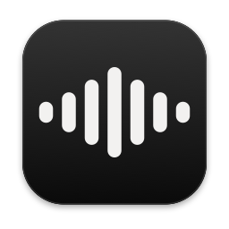
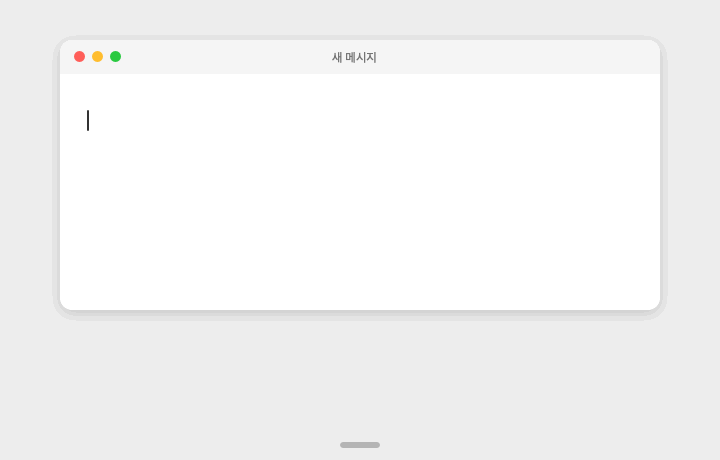
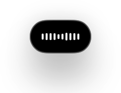
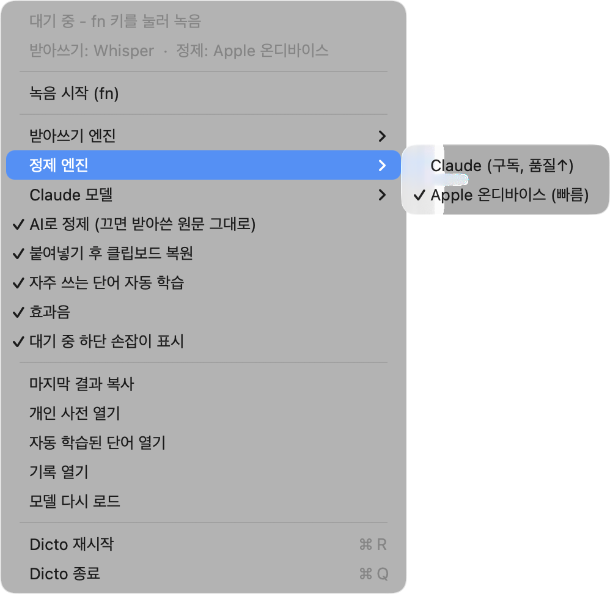

# Dicto

맥용 한국어 음성 받아쓰기 앱. 말하면 지금 커서가 있는 곳에 글로 붙습니다.

- fn(지구본) 키 한 번 → 화면 하단에 파형이 뜨고 녹음 시작
- fn 한 번 더 → 받아쓰기 → AI가 군말·더듬은 말 정리 → 커서 위치에 붙여넣기
- 받아쓰기는 내 맥에서 도는 whisper.cpp, 정제는 Claude 구독 또는 Apple 온디바이스 모델 → 추가 결제 없음

메신저, 메모, 코딩 에이전트 프롬프트처럼 **타이핑하던 자리를 그대로 대체**하는 용도로 만들었습니다. Typeless, Wispr Flow 같은 받아쓰기 앱과 쓰임새가 비슷하고, 그런 앱을 직접 만들어 쓰고 싶은 사람을 위한 오픈소스 구현입니다. (해당 제품들과 아무 관련이 없습니다)

## 화면



*동작 흐름을 같은 색·비율로 그린 재현 영상입니다 (실제 화면 녹화 아님).*

녹음 중에는 화면 맨 아래에 이 파형만 떠 있습니다. 창을 가리지 않고, 입력 포커스도 뺏지 않습니다.



설정은 전부 메뉴바에 있습니다. 받아쓰기·정제 엔진 교체, 개인 사전, 자동 학습 단어 확인까지 여기서 합니다.



## 구성

| 단계 | 사용 | 비용 |
|---|---|---|
| 녹음 | AVAudioEngine → 16kHz mono | 0 |
| STT | Homebrew `whisper-cpp` (libwhisper 인프로세스 링크, Metal) + `ggml-large-v3-turbo-q5_0` | 0 |
| 정제 | Claude Code CLI `claude -p --model haiku` (Claude Max 구독 인증) | 0 (구독 한도 공유) |
| 붙여넣기 | NSPasteboard + CGEvent ⌘V | - |

## 요구 사항

- macOS 14+, Apple Silicon
- `brew install whisper-cpp xcodegen`
- Claude Code CLI 로그인 상태 (`~/.local/bin/claude`)

## 빌드/실행

```bash
make model    # whisper 모델 다운로드 (~570MB, 1회)
make setup    # fn 키 단독 입력 → '아무것도 안 함' (이모지 팝업 방지)
make run      # 빌드 후 실행
make install  # /Applications 에 복사
```

직접 빌드할 때는 프로젝트 루트에 `local.mk` 파일을 만들고 본인 Apple 개발자 팀 ID를 넣으세요. 서명이 고정돼야 손쉬운 사용 권한이 빌드마다 풀리지 않습니다. (`local.mk`는 git에 올라가지 않습니다)

```make
DEVELOPMENT_TEAM := ABCDE12345
```

첫 실행 시 권한 2개 허용:
1. 마이크
2. 손쉬운 사용(접근성) - fn 키 감지 + ⌘V 붙여넣기에 필요

## 메뉴바 설정

- 정제 모델: Haiku(빠름) / Sonnet / Opus
- 언어: 한국어 / English / 자동
- Claude로 정제 끄기 (Whisper 원문 그대로)
- 붙여넣기 후 클립보드 복원
- 개인 사전: `~/Library/Application Support/Dicto/dictionary.txt` (한 줄에 한 단어, Whisper 힌트 + 정제에 반영)
  - `Supabase: 수파베이스, 슈파베이스` → 잘못 들린 표기를 자동 치환. 사전 단어와 한 글자 차이인 영문도 자동 교정
  - `!단어` → 자동 학습 금지
- 자동 학습: 결과에 나온 고유명사/약어(Supabase, MVP 등)를 `learned.txt`에 세고 2회 이상이면 사전에 반영
- 기록: `~/Library/Application Support/Dicto/history.log` (RAW/OUT 쌍)

## 개인정보

받아쓴 원문과 정제 결과는 내 맥의 `~/Library/Application Support/Dicto/` 안(`history.log`, `dicto.log`)에만 저장되고 따로 전송되지 않습니다. 필요 없으면 지워도 됩니다.

단, 정제 엔진으로 Claude를 고르면 받아쓴 텍스트가 본인이 로그인한 Claude Code를 통해 Anthropic으로 전송됩니다. 기기 밖으로 보내고 싶지 않으면 정제를 끄거나 Apple 온디바이스 엔진을 쓰세요.

## 파일

```
Dicto/
  App/DictoApp.swift          메뉴바 앱 + 메뉴
  Core/AppController.swift    상태 머신 (idle → recording → processing)
  Core/FnKeyMonitor.swift     fn 단독 탭 감지 (keyCode 63)
  Core/AudioRecorder.swift    마이크 → 16kHz Float32
  Core/WhisperTranscriber.swift  libwhisper 래퍼
  Core/ClaudeRefiner.swift    claude -p 호출
  Core/RefinePrompt.swift     정제 프롬프트 (여기 수정하면 말투/규칙 바뀜)
  Core/TextPaster.swift       클립보드 + ⌘V
  UI/OverlayPanel.swift       하단 플로팅 패널 (포커스 안 뺏음)
  UI/OverlayView.swift        파형/상태 SwiftUI
  Core/AppleSpeechTranscriber.swift  macOS 26 실시간 받아쓰기 (선택)
  Core/AppleRefiner.swift     macOS 26 온디바이스 정제 (선택)
  Support/Settings.swift      UserDefaults, 경로
  Support/Vocabulary.swift    개인 사전, 자동 교정, 자동 학습
scripts/
  gen_sounds.py               녹음 시작/끝 효과음 합성 (make sounds)
  gen_icon.swift              앱 아이콘 그리기 (make icon)
  gen_demo.swift              README 데모 GIF 그리기 (make demo)
```

효과음과 아이콘은 외부 소스 없이 위 스크립트로 직접 만든 것입니다.

## 라이선스

MIT
